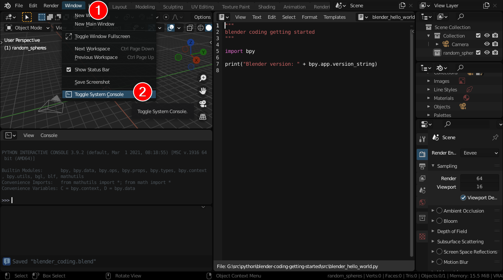

# Blender python coding with VSCode: getting started

Tested with Blender 2.93.0 on Windows 10-64bit but should work also with older/newer versions of Blender and other OS like Linux or macOS

Steps:

1. Install [Blender 2.93.0](https://www.blender.org/)
2. Install [VSCode](https://code.visualstudio.com/)
3. Install [Python](https://www.python.org/) (same version which is used within Blender: 2.93.0 uses Python 3.9.2)
    * to check which version of Python use used within Blender: just open Blender and switch to the "scripting" view and read the Python version:
    
4. Install and setup [VSCode Python Extension](https://marketplace.visualstudio.com/items?itemName=ms-python.python)
    1. Select Python interpreter: CTRL+SHIFT+P -> Python: Select Interpreter
        * select the interpreter from installed Python
    2. Select Python Linter: CTRL+SHIFT+P -> Python: Select Linter
        * select pylint and probably install it

5. Install and setup [VSCode Python Langage Server](https://marketplace.visualstudio.com/items?itemName=ms-python.vscode-pylance)
    1. Configure in your settings:

    ```JSON
    "python.languageServer": "Pylance"
    ```

6. Test Python extension
    1. Open "./src/hello_world.py"
    2. Right-click anywhere in the editor window and select Run Python File in Terminal
    3. You should see something like this:

    ```shell
    Hello World!

    Python version: 3.9.2 (tags/v3.9.2:1a79785, Feb 19 2021, 13:44:55) [MSC v.1928 64 bit (AMD64)]
    ```

7. Install and setup Autocomplete modules for Blender python API
    1. Download clone <https://github.com/Korchy/blender_autocomplete>
    2. Add to User Settings:

    ```JSON
    "python.autoComplete.extraPaths": [
    "<PATH_TO_BLENDER_AUTOCOMPLETE>/blender_autocomplete/2.92"
    ],
    "python.analysis.extraPaths": [
        "<PATH_TO_BLENDER_AUTOCOMPLETE>/blender_autocomplete/2.92"
    ],
    "python.linting.pylintArgs": [
        "--init-hook",
        "import sys; sys.path.append('<PATH_TO_BLENDER_AUTOCOMPLETE>,/blender_autocomplete/2.92')"
    ],
    ```

8. Test script within Blender
    1. Open the blender_coding.blend file with Blender
    2. Toggle console:
    
    3. Run the blender_hello_world.py script, it should display the blender version in the console window
    
